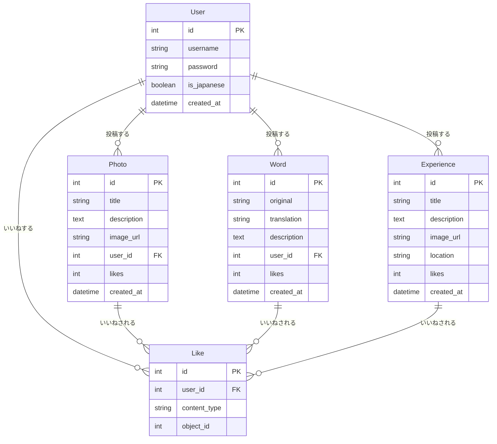

# データベース設計書

## ER図

## テーブル定義

### Users テーブル

| カラム名    | 型           | NULL | デフォルト        | キー   | 説明                       |
| ----------- | ------------ | ---- | ----------------- | ------ | -------------------------- |
| id          | INTEGER      | NO   | AUTO_INCREMENT    | PK     | ユーザー ID                |
| username    | VARCHAR(150) | NO   | -                 | UNIQUE | ユーザー名                 |
| password    | VARCHAR(128) | NO   | -                 | -      | ハッシュ化されたパスワード |
| is_japanese | BOOLEAN      | NO   | false             | -      | 日本人フラグ               |
| created_at  | TIMESTAMP    | NO   | CURRENT_TIMESTAMP | -      | 作成日時                   |

インデックス:

- username (UNIQUE)
- created_at

### Photos テーブル

| カラム名    | 型           | NULL | デフォルト        | キー | 説明      |
| ----------- | ------------ | ---- | ----------------- | ---- | --------- |
| id          | INTEGER      | NO   | AUTO_INCREMENT    | PK   | 写真 ID   |
| title       | VARCHAR(200) | NO   | -                 | -    | タイトル  |
| description | TEXT         | YES  | NULL              | -    | 説明      |
| image_url   | VARCHAR(255) | NO   | -                 | -    | 画像 URL  |
| user_id     | INTEGER      | NO   | -                 | FK   | 投稿者 ID |
| likes       | INTEGER      | NO   | 0                 | -    | いいね数  |
| created_at  | TIMESTAMP    | NO   | CURRENT_TIMESTAMP | -    | 投稿日時  |

インデックス:

- user_id
- likes
- created_at

### Words テーブル

| カラム名    | 型           | NULL | デフォルト        | キー | 説明               |
| ----------- | ------------ | ---- | ----------------- | ---- | ------------------ |
| id          | INTEGER      | NO   | AUTO_INCREMENT    | PK   | 言葉 ID            |
| original    | VARCHAR(200) | NO   | -                 | -    | 元の言葉（日本語） |
| translation | VARCHAR(200) | NO   | -                 | -    | 翻訳（英語）       |
| description | TEXT         | YES  | NULL              | -    | 説明               |
| user_id     | INTEGER      | NO   | -                 | FK   | 投稿者 ID          |
| likes       | INTEGER      | NO   | 0                 | -    | いいね数           |
| created_at  | TIMESTAMP    | NO   | CURRENT_TIMESTAMP | -    | 投稿日時           |

インデックス:

- user_id
- original
- likes
- created_at

### Experiences テーブル

| カラム名    | 型           | NULL | デフォルト        | キー | 説明     |
| ----------- | ------------ | ---- | ----------------- | ---- | -------- |
| id          | INTEGER      | NO   | AUTO_INCREMENT    | PK   | 体験 ID  |
| title       | VARCHAR(200) | NO   | -                 | -    | タイトル |
| description | TEXT         | YES  | NULL              | -    | 説明     |
| image_url   | VARCHAR(255) | YES  | NULL              | -    | 画像 URL |
| location    | VARCHAR(200) | NO   | -                 | -    | 場所     |
| likes       | INTEGER      | NO   | 0                 | -    | いいね数 |
| created_at  | TIMESTAMP    | NO   | CURRENT_TIMESTAMP | -    | 投稿日時 |

インデックス:

- location
- likes
- created_at

### Likes テーブル

| カラム名     | 型           | NULL | デフォルト     | キー | 説明             |
| ------------ | ------------ | ---- | -------------- | ---- | ---------------- |
| id           | INTEGER      | NO   | AUTO_INCREMENT | PK   | いいね ID        |
| user_id      | INTEGER      | NO   | -              | FK   | ユーザー ID      |
| content_type | VARCHAR(100) | NO   | -              | -    | コンテンツタイプ |
| object_id    | INTEGER      | NO   | -              | -    | コンテンツ ID    |

インデックス:

- user_id
- (content_type, object_id)

## データベース制約

### 外部キー制約

1. Photos.user_id → Users.id (CASCADE DELETE)
2. Words.user_id → Users.id (CASCADE DELETE)
3. Experiences.user_id → Users.id (CASCADE DELETE)
4. Likes.user_id → Users.id (CASCADE DELETE)

### ユニーク制約

1. Users.username
2. Likes (user_id, content_type, object_id)

## バックアップ戦略

1. **自動バックアップ**

   - 毎日深夜にフルバックアップ
   - バックアップ保持期間: 7 日間

2. **ポイントインタイムリカバリ**

   - WAL アーカイブの保持
   - リカバリ時間目標: 1 時間以内

3. **バックアップ検証**
   - 週 1 回の自動リストア確認
   - バックアップデータの整合性チェック
