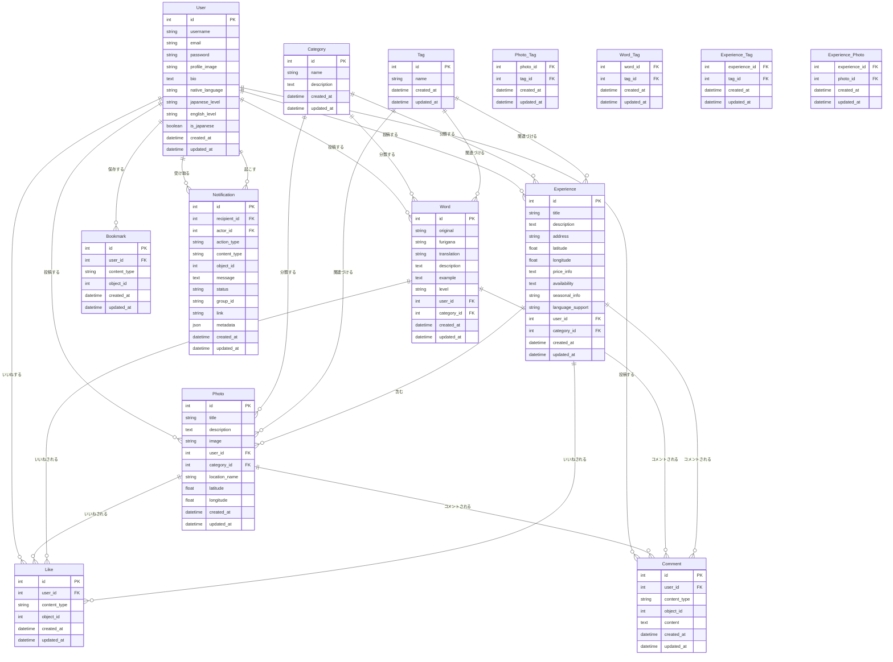

# データベース設計書

## ER 図



## テーブル定義

### Users テーブル

| カラム名        | 型           | NULL | デフォルト        | キー   | 説明                       |
| --------------- | ------------ | ---- | ----------------- | ------ | -------------------------- |
| id              | INTEGER      | NO   | AUTO_INCREMENT    | PK     | ユーザー ID                |
| username        | VARCHAR(100) | NO   | -                 | UNIQUE | ユーザー名                 |
| email           | VARCHAR(254) | NO   | -                 | UNIQUE | メールアドレス             |
| password        | VARCHAR(128) | NO   | -                 | -      | ハッシュ化されたパスワード |
| profile_image   | VARCHAR(255) | YES  | NULL              | -      | プロフィール画像パス       |
| bio             | TEXT         | YES  | NULL              | -      | 自己紹介文                 |
| native_language | VARCHAR(50)  | YES  | NULL              | -      | 母語                       |
| japanese_level  | VARCHAR(50)  | YES  | NULL              | -      | 日本語レベル               |
| english_level   | VARCHAR(50)  | YES  | NULL              | -      | 英語レベル                 |
| is_japanese     | BOOLEAN      | NO   | false             | -      | 日本人フラグ（true/false） |
| created_at      | TIMESTAMP    | NO   | CURRENT_TIMESTAMP | -      | 作成日時                   |
| updated_at      | TIMESTAMP    | NO   | CURRENT_TIMESTAMP | -      | 更新日時（編集時に更新）   |

インデックス:

- username (UNIQUE)
- email (UNIQUE)
- created_at

### Categories テーブル

| カラム名    | 型           | NULL | デフォルト        | キー | 説明                     |
| ----------- | ------------ | ---- | ----------------- | ---- | ------------------------ |
| id          | INTEGER      | NO   | AUTO_INCREMENT    | PK   | カテゴリ ID              |
| name        | VARCHAR(100) | NO   | -                 | -    | カテゴリ名               |
| description | TEXT         | YES  | NULL              | -    | 説明                     |
| created_at  | TIMESTAMP    | NO   | CURRENT_TIMESTAMP | -    | 作成日時                 |
| updated_at  | TIMESTAMP    | NO   | CURRENT_TIMESTAMP | -    | 更新日時（編集時に更新） |

インデックス:

- name

### Tags テーブル

| カラム名   | 型          | NULL | デフォルト        | キー | 説明                     |
| ---------- | ----------- | ---- | ----------------- | ---- | ------------------------ |
| id         | INTEGER     | NO   | AUTO_INCREMENT    | PK   | タグ ID                  |
| name       | VARCHAR(50) | NO   | -                 | -    | タグ名                   |
| created_at | TIMESTAMP   | NO   | CURRENT_TIMESTAMP | -    | 作成日時                 |
| updated_at | TIMESTAMP   | NO   | CURRENT_TIMESTAMP | -    | 更新日時（編集時に更新） |

インデックス:

- name

### Photos テーブル

| カラム名      | 型           | NULL | デフォルト        | キー | 説明                     |
| ------------- | ------------ | ---- | ----------------- | ---- | ------------------------ |
| id            | INTEGER      | NO   | AUTO_INCREMENT    | PK   | 写真 ID                  |
| title         | VARCHAR(200) | NO   | -                 | -    | タイトル                 |
| description   | TEXT         | YES  | NULL              | -    | 説明                     |
| image         | VARCHAR(255) | NO   | -                 | -    | 画像ファイル保存パス     |
| user_id       | INTEGER      | NO   | -                 | FK   | 投稿者 ID                |
| category_id   | INTEGER      | YES  | NULL              | FK   | カテゴリ ID              |
| location_name | VARCHAR(200) | YES  | NULL              | -    | 場所の名称               |
| latitude      | FLOAT        | YES  | NULL              | -    | 緯度                     |
| longitude     | FLOAT        | YES  | NULL              | -    | 経度                     |
| created_at    | TIMESTAMP    | NO   | CURRENT_TIMESTAMP | -    | 投稿日時                 |
| updated_at    | TIMESTAMP    | NO   | CURRENT_TIMESTAMP | -    | 更新日時（編集時に更新） |

インデックス:

- user_id
- category_id
- location_name
- created_at
- (latitude, longitude)

### Words テーブル

| カラム名    | 型           | NULL | デフォルト        | キー | 説明                     |
| ----------- | ------------ | ---- | ----------------- | ---- | ------------------------ |
| id          | INTEGER      | NO   | AUTO_INCREMENT    | PK   | 言葉 ID                  |
| original    | VARCHAR(100) | NO   | -                 | -    | 元の言葉（日本語）       |
| furigana    | VARCHAR(200) | YES  | NULL              | -    | ふりがな                 |
| translation | VARCHAR(200) | NO   | -                 | -    | 翻訳（英語）             |
| description | TEXT         | YES  | NULL              | -    | 説明                     |
| example     | TEXT         | YES  | NULL              | -    | 使用例                   |
| level       | VARCHAR(20)  | YES  | NULL              | -    | 難易度                   |
| user_id     | INTEGER      | NO   | -                 | FK   | 投稿者 ID                |
| category_id | INTEGER      | YES  | NULL              | FK   | カテゴリ ID              |
| created_at  | TIMESTAMP    | NO   | CURRENT_TIMESTAMP | -    | 投稿日時                 |
| updated_at  | TIMESTAMP    | NO   | CURRENT_TIMESTAMP | -    | 更新日時（編集時に更新） |

インデックス:

- user_id
- category_id
- original
- level
- created_at

### Experiences テーブル

| カラム名         | 型           | NULL | デフォルト        | キー | 説明                     |
| ---------------- | ------------ | ---- | ----------------- | ---- | ------------------------ |
| id               | INTEGER      | NO   | AUTO_INCREMENT    | PK   | 体験 ID                  |
| title            | VARCHAR(200) | NO   | -                 | -    | タイトル                 |
| description      | TEXT         | YES  | NULL              | -    | 説明                     |
| address          | VARCHAR(255) | NO   | -                 | -    | 住所                     |
| latitude         | FLOAT        | NO   | -                 | -    | 緯度                     |
| longitude        | FLOAT        | NO   | -                 | -    | 経度                     |
| price_info       | TEXT         | YES  | NULL              | -    | 料金情報                 |
| availability     | TEXT         | YES  | NULL              | -    | 利用可能時間             |
| seasonal_info    | VARCHAR(100) | YES  | NULL              | -    | 季節情報                 |
| language_support | VARCHAR(255) | YES  | NULL              | -    | 対応言語                 |
| user_id          | INTEGER      | NO   | -                 | FK   | 投稿者 ID                |
| category_id      | INTEGER      | YES  | NULL              | FK   | カテゴリ ID              |
| created_at       | TIMESTAMP    | NO   | CURRENT_TIMESTAMP | -    | 投稿日時                 |
| updated_at       | TIMESTAMP    | NO   | CURRENT_TIMESTAMP | -    | 更新日時（編集時に更新） |

インデックス:

- user_id
- category_id
- address
- (latitude, longitude)
- seasonal_info
- created_at

### Comments テーブル

| カラム名     | 型           | NULL | デフォルト        | キー | 説明             |
| ------------ | ------------ | ---- | ----------------- | ---- | ---------------- |
| id           | INTEGER      | NO   | AUTO_INCREMENT    | PK   | コメント ID      |
| user_id      | INTEGER      | NO   | -                 | FK   | ユーザー ID      |
| content_type | VARCHAR(100) | NO   | -                 | -    | コンテンツタイプ |
| object_id    | INTEGER      | NO   | -                 | -    | コンテンツ ID    |
| content      | TEXT         | NO   | -                 | -    | コメント内容     |
| created_at   | TIMESTAMP    | NO   | CURRENT_TIMESTAMP | -    | 投稿日時         |
| updated_at   | TIMESTAMP    | NO   | CURRENT_TIMESTAMP | -    | 更新日時         |

インデックス:

- user_id
- (content_type, object_id)
- created_at

### Likes テーブル

| カラム名     | 型           | NULL | デフォルト        | キー | 説明                     |
| ------------ | ------------ | ---- | ----------------- | ---- | ------------------------ |
| id           | INTEGER      | NO   | AUTO_INCREMENT    | PK   | いいね ID                |
| user_id      | INTEGER      | NO   | -                 | FK   | ユーザー ID              |
| content_type | VARCHAR(100) | NO   | -                 | -    | コンテンツタイプ         |
| object_id    | INTEGER      | NO   | -                 | -    | コンテンツ ID            |
| created_at   | TIMESTAMP    | NO   | CURRENT_TIMESTAMP | -    | 作成日時                 |
| updated_at   | TIMESTAMP    | NO   | CURRENT_TIMESTAMP | -    | 更新日時（編集時に更新） |

インデックス:

- user_id
- (content_type, object_id)

### Bookmarks テーブル

| カラム名     | 型           | NULL | デフォルト        | キー | 説明                     |
| ------------ | ------------ | ---- | ----------------- | ---- | ------------------------ |
| id           | INTEGER      | NO   | AUTO_INCREMENT    | PK   | ブックマーク ID          |
| user_id      | INTEGER      | NO   | -                 | FK   | ユーザー ID              |
| content_type | VARCHAR(100) | NO   | -                 | -    | コンテンツタイプ         |
| object_id    | INTEGER      | NO   | -                 | -    | コンテンツ ID            |
| created_at   | TIMESTAMP    | NO   | CURRENT_TIMESTAMP | -    | 作成日時                 |
| updated_at   | TIMESTAMP    | NO   | CURRENT_TIMESTAMP | -    | 更新日時（編集時に更新） |

インデックス:

- user_id
- (content_type, object_id)

### Notifications テーブル

| カラム名     | 型           | NULL | デフォルト        | キー | 説明                                             |
| ------------ | ------------ | ---- | ----------------- | ---- | ------------------------------------------------ |
| id           | INTEGER      | NO   | AUTO_INCREMENT    | PK   | 通知 ID                                          |
| recipient_id | INTEGER      | NO   | -                 | FK   | 通知を受け取るユーザー ID                        |
| actor_id     | INTEGER      | YES  | NULL              | FK   | アクションを起こしたユーザー ID                  |
| action_type  | VARCHAR(50)  | NO   | -                 | -    | アクションタイプ（like, comment, bookmark など） |
| content_type | VARCHAR(100) | NO   | -                 | -    | 対象のエンティティタイプ                         |
| object_id    | INTEGER      | NO   | -                 | -    | 対象のエンティティ ID                            |
| message      | TEXT         | YES  | NULL              | -    | 通知メッセージ                                   |
| status       | VARCHAR(20)  | NO   | 'unread'          | -    | 状態（unread, read, archived, deleted）          |
| group_id     | VARCHAR(100) | YES  | NULL              | -    | 類似通知のグルーピング用                         |
| link         | VARCHAR(255) | YES  | NULL              | -    | 通知クリック時の遷移先 URL/ルート                |
| metadata     | JSON         | YES  | NULL              | -    | 追加情報                                         |
| created_at   | TIMESTAMP    | NO   | CURRENT_TIMESTAMP | -    | 作成日時                                         |
| updated_at   | TIMESTAMP    | NO   | CURRENT_TIMESTAMP | -    | 更新日時                                         |

インデックス:

- recipient_id
- actor_id
- (content_type, object_id)
- status
- group_id
- created_at

### Photo_Tag テーブル (多対多の中間テーブル)

| カラム名   | 型        | NULL | デフォルト        | キー | 説明                     |
| ---------- | --------- | ---- | ----------------- | ---- | ------------------------ |
| photo_id   | INTEGER   | NO   | -                 | FK   | 写真 ID                  |
| tag_id     | INTEGER   | NO   | -                 | FK   | タグ ID                  |
| created_at | TIMESTAMP | NO   | CURRENT_TIMESTAMP | -    | 作成日時                 |
| updated_at | TIMESTAMP | NO   | CURRENT_TIMESTAMP | -    | 更新日時（編集時に更新） |

インデックス:

- (photo_id, tag_id) (UNIQUE)
- tag_id

### Word_Tag テーブル (多対多の中間テーブル)

| カラム名   | 型        | NULL | デフォルト        | キー | 説明                     |
| ---------- | --------- | ---- | ----------------- | ---- | ------------------------ |
| word_id    | INTEGER   | NO   | -                 | FK   | 言葉 ID                  |
| tag_id     | INTEGER   | NO   | -                 | FK   | タグ ID                  |
| created_at | TIMESTAMP | NO   | CURRENT_TIMESTAMP | -    | 作成日時                 |
| updated_at | TIMESTAMP | NO   | CURRENT_TIMESTAMP | -    | 更新日時（編集時に更新） |

インデックス:

- (word_id, tag_id) (UNIQUE)
- tag_id

### Experience_Tag テーブル (多対多の中間テーブル)

| カラム名      | 型        | NULL | デフォルト        | キー | 説明                     |
| ------------- | --------- | ---- | ----------------- | ---- | ------------------------ |
| experience_id | INTEGER   | NO   | -                 | FK   | 体験 ID                  |
| tag_id        | INTEGER   | NO   | -                 | FK   | タグ ID                  |
| created_at    | TIMESTAMP | NO   | CURRENT_TIMESTAMP | -    | 作成日時                 |
| updated_at    | TIMESTAMP | NO   | CURRENT_TIMESTAMP | -    | 更新日時（編集時に更新） |

インデックス:

- (experience_id, tag_id) (UNIQUE)
- tag_id

### Experience_Photo テーブル (多対多の中間テーブル)

| カラム名      | 型        | NULL | デフォルト        | キー | 説明                     |
| ------------- | --------- | ---- | ----------------- | ---- | ------------------------ |
| experience_id | INTEGER   | NO   | -                 | FK   | 体験 ID                  |
| photo_id      | INTEGER   | NO   | -                 | FK   | 写真 ID                  |
| created_at    | TIMESTAMP | NO   | CURRENT_TIMESTAMP | -    | 作成日時                 |
| updated_at    | TIMESTAMP | NO   | CURRENT_TIMESTAMP | -    | 更新日時（編集時に更新） |

インデックス:

- (experience_id, photo_id) (UNIQUE)
- photo_id

## データベース制約

### 外部キー制約

1. Photos.user_id → Users.id (CASCADE DELETE)
2. Photos.category_id → Categories.id (SET NULL)
3. Words.user_id → Users.id (CASCADE DELETE)
4. Words.category_id → Categories.id (SET NULL)
5. Experiences.user_id → Users.id (CASCADE DELETE)
6. Experiences.category_id → Categories.id (SET NULL)
7. Comments.user_id → Users.id (CASCADE DELETE)
8. Likes.user_id → Users.id (CASCADE DELETE)
9. Bookmarks.user_id → Users.id (CASCADE DELETE)
10. Photo_Tag.photo_id → Photos.id (CASCADE DELETE)
11. Photo_Tag.tag_id → Tags.id (CASCADE DELETE)
12. Word_Tag.word_id → Words.id (CASCADE DELETE)
13. Word_Tag.tag_id → Tags.id (CASCADE DELETE)
14. Experience_Tag.experience_id → Experiences.id (CASCADE DELETE)
15. Experience_Tag.tag_id → Tags.id (CASCADE DELETE)
16. Experience_Photo.experience_id → Experiences.id (CASCADE DELETE)
17. Experience_Photo.photo_id → Photos.id (CASCADE DELETE)

### ユニーク制約

1. Users.username
2. Users.email
3. Likes (user_id, content_type, object_id)
4. Bookmarks (user_id, content_type, object_id)
5. Photo_Tag (photo_id, tag_id)
6. Word_Tag (word_id, tag_id)
7. Experience_Tag (experience_id, tag_id)
8. Experience_Photo (experience_id, photo_id)

## Django モデル実装例

```python
class User(models.Model):
    username = models.CharField(max_length=100, unique=True)
    email = models.EmailField(unique=True)
    password = models.CharField(max_length=128)  # ハッシュ化されることを前提
    profile_image = models.ImageField(upload_to='profiles/', null=True, blank=True)
    bio = models.TextField(blank=True)
    native_language = models.CharField(
        max_length=50,
        choices=LANGUAGE_CHOICES,
        verbose_name="母国語"
    )
    japanese_level = models.CharField(
        max_length=20,
        choices=LANGUAGE_LEVELS,
        blank=True,
        null=True,
        verbose_name="日本語レベル"
    )
    english_level = models.CharField(
        max_length=20,
        choices=LANGUAGE_LEVELS,
        blank=True,
        null=True,
        verbose_name="英語レベル"
    )
    is_japanese = models.BooleanField(default=False, verbose_name="日本人フラグ")
    created_at = models.DateTimeField(auto_now_add=True)
    updated_at = models.DateTimeField(auto_now=True)

    # 言語
    LANGUAGE_CHOICES = [
        ('japanese', '日本語'),
        ('english', '英語'),
        ('chinese', '中国語'),
        ('korean', '韓国語'),
        ('french', 'フランス語'),
        ('german', 'ドイツ語'),
        ('spanish', 'スペイン語'),
        ('other', 'その他'),
    ]

    # 言語レベル区分
    LANGUAGE_LEVELS = [
        ('none', '学習経験なし'),
        ('beginner', '少しわかる（初心者レベル）'),
        ('daily', '日常会話レベル'),
        ('business', 'ビジネスレベル'),
        ('native', 'ネイティブレベル'),
    ]

    class Meta:
        indexes = [
            models.Index(fields=['username']),
            models.Index(fields=['email']),
            models.Index(fields=['native_language']),
            models.Index(fields=['japanese_level']),
            models.Index(fields=['english_level']),
            models.Index(fields=['created_at']),
        ]

    def __str__(self):
        return self.username


class Category(models.Model):
    name = models.CharField(max_length=100)
    description = models.TextField(blank=True)

    class Meta:
        verbose_name_plural = 'Categories'
        indexes = [
            models.Index(fields=['name']),
        ]

    def __str__(self):
        return self.name

class Tag(models.Model):
    name = models.CharField(max_length=50)

    class Meta:
        indexes = [
            models.Index(fields=['name']),
        ]

    def __str__(self):
        return self.name

class Photo(models.Model):
    title = models.CharField(max_length=200)
    description = models.TextField(blank=True)
    image = models.ImageField(upload_to='photos/')
    // ローカルではMEDIA_ROOT, URLでリソースの位置を指定。本番ではS3にアップロード
    user = models.ForeignKey(User, on_delete=models.CASCADE, related_name='photos')
    category = models.ForeignKey(Category, on_delete=models.SET_NULL, null=True, related_name='photos')
    tags = models.ManyToManyField(Tag, blank=True, related_name='photos')
    location_name = models.CharField(max_length=200, blank=True)
    latitude = models.FloatField(null=True, blank=True)
    longitude = models.FloatField(null=True, blank=True)
    created_at = models.DateTimeField(auto_now_add=True)
    updated_at = models.DateTimeField(auto_now=True)

    class Meta:
        ordering = ['-created_at']
        indexes = [
            models.Index(fields=['user']),
            models.Index(fields=['category']),
            models.Index(fields=['location_name']),
            models.Index(fields=['created_at']),
            models.Index(fields=['latitude', 'longitude']),
        ]

    def __str__(self):
        return self.title

class Word(models.Model):
    original = models.CharField(max_length=100)
    furigana = models.CharField(max_length=200, blank=True)
    translation = models.CharField(max_length=200)
    description = models.TextField(blank=True)
    example = models.TextField(blank=True)
    DIFFICULTY_LEVELS = [
        ('beginner', '初級'),
        ('intermediate', '中級'),
        ('advanced', '上級'),
    ]
    level = models.CharField(max_length=20, choices=DIFFICULTY_LEVELS, blank=True)
    user = models.ForeignKey(User, on_delete=models.CASCADE, related_name='words')
    category = models.ForeignKey(Category, on_delete=models.SET_NULL, null=True, related_name='words')
    tags = models.ManyToManyField(Tag, blank=True, related_name='words')
    created_at = models.DateTimeField(auto_now_add=True)
    updated_at = models.DateTimeField(auto_now=True)

    class Meta:
        indexes = [
            models.Index(fields=['user']),
            models.Index(fields=['category']),
            models.Index(fields=['original']),
            models.Index(fields=['level']),
            models.Index(fields=['created_at']),
        ]

    def __str__(self):
        return self.original

class Experience(models.Model):
    title = models.CharField(max_length=200)
    description = models.TextField(blank=True)
    images = models.ManyToManyField(Photo, blank=True, related_name='experiences')
    address = models.CharField(max_length=255)
    latitude = models.FloatField()
    longitude = models.FloatField()
    price_info = models.TextField(blank=True)
    availability = models.TextField(blank=True)
    seasonal_info = models.CharField(max_length=100, blank=True)
    language_support = models.CharField(max_length=255, blank=True)
    user = models.ForeignKey(User, on_delete=models.CASCADE, related_name='experiences')
    category = models.ForeignKey(Category, on_delete=models.SET_NULL, null=True, related_name='experiences')
    tags = models.ManyToManyField(Tag, blank=True, related_name='experiences')
    created_at = models.DateTimeField(auto_now_add=True)
    updated_at = models.DateTimeField(auto_now=True)

    class Meta:
        indexes = [
            models.Index(fields=['user']),
            models.Index(fields=['category']),
            models.Index(fields=['address']),
            models.Index(fields=['latitude', 'longitude']),
            models.Index(fields=['seasonal_info']),
            models.Index(fields=['created_at']),
        ]

    def __str__(self):
        return self.title

class Comment(models.Model):
    user = models.ForeignKey(User, on_delete=models.CASCADE, related_name='comments')
    content = models.TextField()
    content_type = models.ForeignKey(ContentType, on_delete=models.CASCADE)
    object_id = models.PositiveIntegerField()
    content_object = GenericForeignKey('content_type', 'object_id')
    created_at = models.DateTimeField(auto_now_add=True)
    updated_at = models.DateTimeField(auto_now=True)

    class Meta:
        indexes = [
            models.Index(fields=['user']),
            models.Index(fields=['content_type', 'object_id']),
            models.Index(fields=['created_at']),
        ]

    def __str__(self):
        return f'Comment by {self.user.username} on {self.content_object}'

class Like(models.Model):
    user = models.ForeignKey(User, on_delete=models.CASCADE, related_name='likes')
    content_type = models.ForeignKey(ContentType, on_delete=models.CASCADE)
    object_id = models.PositiveIntegerField()
    content_object = GenericForeignKey('content_type', 'object_id')
    created_at = models.DateTimeField(auto_now_add=True)

    class Meta:
        unique_together = ('user', 'content_type', 'object_id')
        indexes = [
            models.Index(fields=['user']),
            models.Index(fields=['content_type', 'object_id']),
        ]

    def __str__(self):
        return f'Like by {self.user.username} on {self.content_object}'

class Bookmark(models.Model):
    user = models.ForeignKey(User, on_delete=models.CASCADE, related_name='bookmarks')
    content_type = models.ForeignKey(ContentType, on_delete=models.CASCADE)
    object_id = models.PositiveIntegerField()
    content_object = GenericForeignKey('content_type', 'object_id')
    created_at = models.DateTimeField(auto_now_add=True)

    class Meta:
        unique_together = ('user', 'content_type', 'object_id')
        indexes = [
            models.Index(fields=['user']),
            models.Index(fields=['content_type', 'object_id']),
        ]

    def __str__(self):
        return f'Bookmark by {self.user.username} on {self.content_object}'
```
